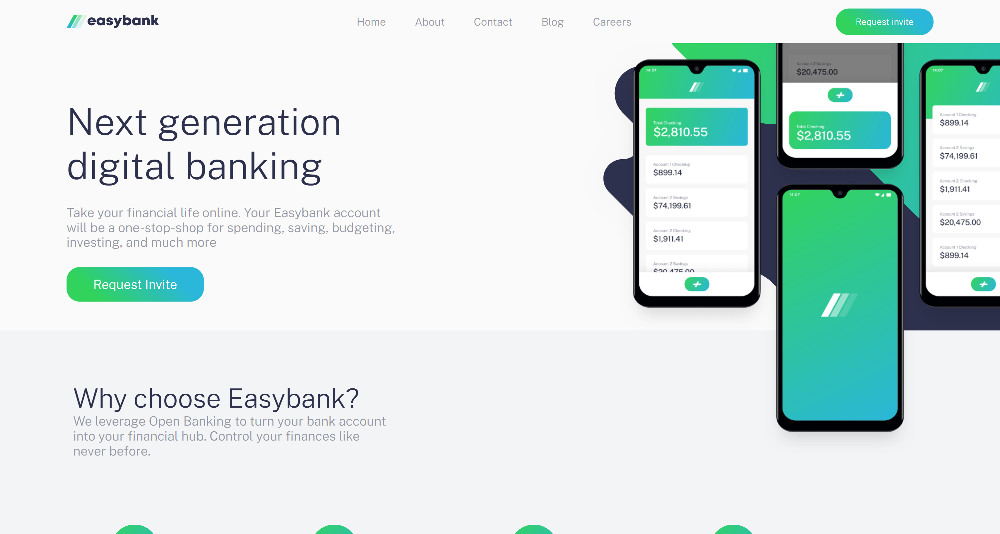

# Frontend Mentor - Easybank landing page solution

This is a solution to the [Easybank landing page challenge on Frontend Mentor](https://www.frontendmentor.io/challenges/easybank-landing-page-WaUhkoDN). Frontend Mentor challenges help you improve your coding skills by building realistic projects.

## Table of contents

- [Overview](#overview)
  - [The challenge](#the-challenge)
  - [Screenshot](#screenshot)
  - [Links](#links)
- [My process](#my-process)
- [Acknowledgments](#acknowledgments)

## Overview

### The challenge

Users should be able to:

- View the optimal layout for the site depending on their device's screen size
- See hover states for all interactive elements on the page

### Screenshot



## Links

- Repositorie [UwU](https://github.com/XxtbmfxX/frontmentor_easy-landing)
- Solution [UwU](https://github.com/)

## My process

The mos difficult part was the image that was over the other elements but with a

```css
z-index
```

thing i solved it :D

## Acknowledgments

The video of [beyondfireship](https://www.youtube.com/@beyondfireship/featured) Helped me to do the animations
